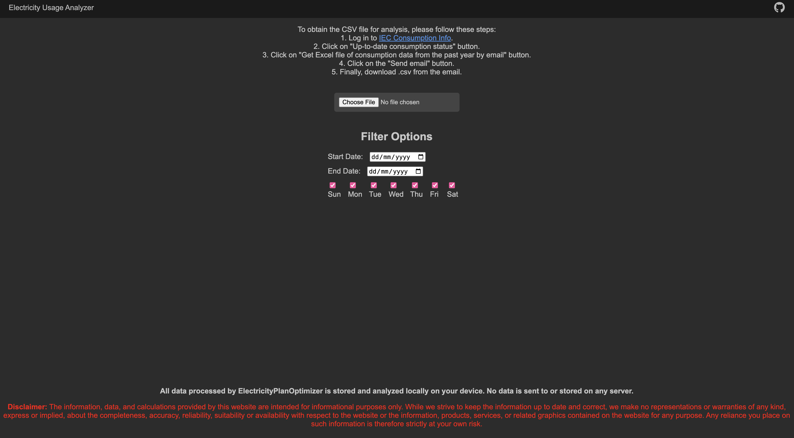

# ElectricityPlanOptimizer

## Description
ElectricityPlanOptimizer is a JavaScript-based application that helps users analyze their electricity usage. It provides a detailed breakdown of consumption patterns and suggests the most cost-effective electricity plan based on the user's usage data.

## Live Website
You can access the live website [here](https://chizkiyahu.github.io/ElectricityPlanOptimizer/).

## Features
- Analyze electricity usage from CSV data
- Filter data by date and day of the week
- Visualize data with interactive charts
- Calculate the most cost-effective electricity plan

## Data Privacy
All data processed by ElectricityPlanOptimizer is stored and analyzed locally on your device. No data is sent to or stored on any server.

